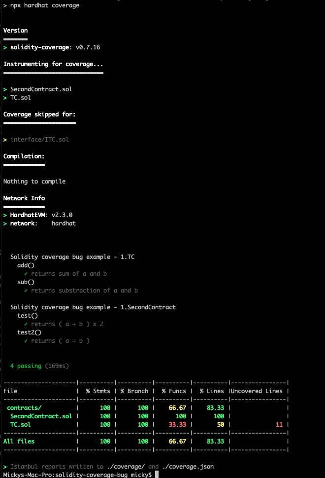

# solidity-coverage-bug

Using an all capitals contract name, and then using it's interface name in a second contract breaks coverage, and the results only cover the "new interface"

ie.

`contract TC`

`interface ITC`

## Example result:

